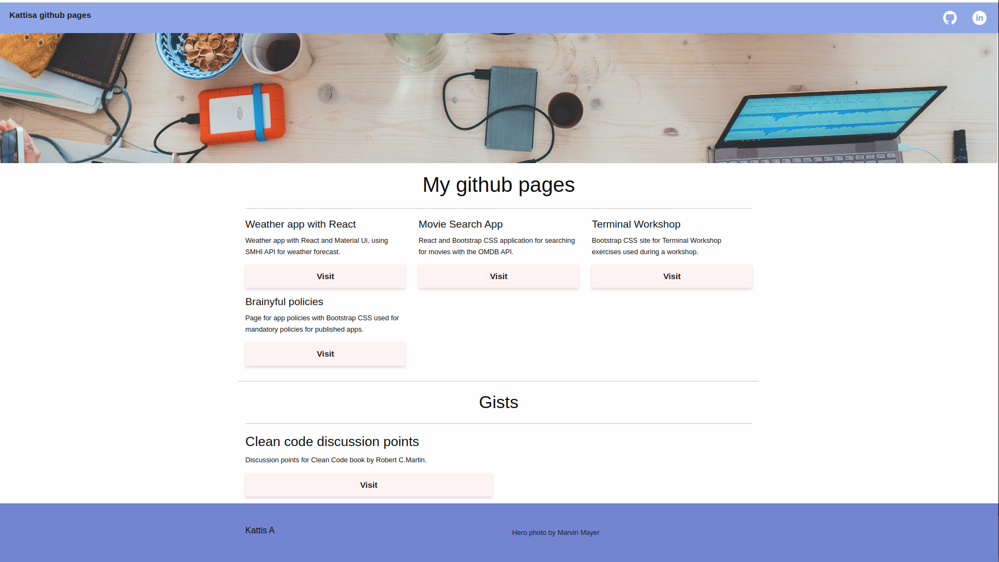

# GitHub pages landing page

The page for hosting my GitHub pages providing links for my published pages and gists.

## Description

An in-depth paragraph about your project and overview of use.

## Visit

The GitHub pages for [KattisA](https://kattisa.github.io/).

### Dependencies

This is a html site using foundation.

### Installing

Just run the index.html file in the browser of your choice.

## Authors

This repository belong to Katarina Lejonlid.

## Acknowledgments

* [Foundation template](https://get.foundation/templates-previews-sites-f6-xy-grid/ecommerce.html)

